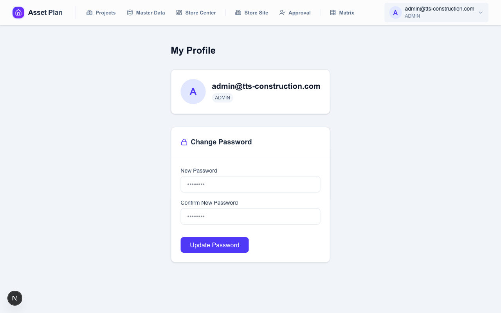

# คู่มือการใช้งานระบบ Asset Plan

> ระบบวางแผนและบริหารจัดการครุภัณฑ์สำหรับโครงการก่อสร้างและคลังกลาง  
> Version: 2.1 | อัปเดต: 2026-06-11

คู่มือฉบับนี้เป็นคู่มือการใช้งานหลักแบบอ่านข้อความ โดย sync ให้ตรงกับ `docs/manuals/visual_user_guide.md` และภาพชุดล่าสุดใน `public/docs/manual/assets/`

---

## สารบัญ

1. [ภาพรวมระบบและบทบาทผู้ใช้](#1-ภาพรวมระบบและบทบาทผู้ใช้)
2. [การเข้าสู่ระบบและเมนูหลัก](#2-การเข้าสู่ระบบและเมนูหลัก)
3. [Site Plan — การกรอกแผนความต้องการ](#3-site-plan--การกรอกแผนความต้องการ)
4. [PM Approval — การตรวจสอบและอนุมัติแผน](#4-pm-approval--การตรวจสอบและอนุมัติแผน)
5. [Store Center — จัดการใบงาน](#5-store-center--จัดการใบงาน)
6. [Store Center — ความต้องการสุทธิ](#6-store-center--ความต้องการสุทธิ)
7. [Matrix Report — รายงานภาพรวม](#7-matrix-report--รายงานภาพรวม)
8. [Master Data — ข้อมูลครุภัณฑ์](#8-master-data--ข้อมูลครุภัณฑ์)
9. [Admin — ตั้งค่าระบบ](#9-admin--ตั้งค่าระบบ)
10. [Profile — เปลี่ยนรหัสผ่าน](#10-profile--เปลี่ยนรหัสผ่าน)
11. [ขั้นตอนการทำงานทั้งระบบ](#11-ขั้นตอนการทำงานทั้งระบบ)
12. [แหล่งภาพประกอบ](#12-แหล่งภาพประกอบ)
13. [คำถามที่พบบ่อย](#13-คำถามที่พบบ่อย)

---

## 1. ภาพรวมระบบและบทบาทผู้ใช้

Asset Plan ช่วยให้ทีมโครงการแจ้งความต้องการครุภัณฑ์ล่วงหน้าเป็นรอบแผน, ให้ PM ตรวจสอบความเหมาะสม, และให้คลังกลางจัดสรรพร้อมติดตามของคืนอย่างเป็นระบบ

### บทบาทผู้ใช้งาน

| Role | ชื่อเรียก | หน้าที่ | เข้าถึงหน้า |
|---|---|---|---|
| **STORE_SITE** | ผู้กรอกแผน | กรอกและส่งแผนความต้องการของไซต์ | `/site-plan` |
| **PROJECT_MANAGER** | ผู้อนุมัติ | ตรวจ, แก้ไข, อนุมัติ, ตีกลับแผน | `/site-plan/pm-approval` |
| **VIEWER** | ผู้ดูอย่างเดียว | ดูข้อมูลแต่ไม่แก้ไข | `/site-plan` |
| **STORE_CENTER** | ทีมคลังกลาง | สร้างรอบแผน, จัดสรร, รับคืน, export | `/store-center`, `/matrix-report`, `/master-data` |
| **ADMIN** | ผู้ดูแลระบบ | จัดการผู้ใช้, โครงการ, สิทธิ์, และเข้าทุกหน้า | `/admin/*` |

> หมายเหตุ: ผู้ใช้ 1 คนมี `global_role` ได้ 1 ค่า แต่มี project role ได้หลายโครงการ

---

## 2. การเข้าสู่ระบบและเมนูหลัก

### 2.1 Login `/login`

ผู้ใช้เริ่มต้นที่หน้า Login เพื่อกรอก Email และ Password


### 2.2 Home / Portal `/`

หลัง login สำเร็จ ระบบจะแสดง card เมนูตามสิทธิ์ที่ผู้ใช้มี เช่น Projects, Master Data, Store Site, Project Approval, Store Center และ Matrix Report


### 2.3 Navbar และเมนูตามสิทธิ์

- `STORE_CENTER` และ `ADMIN` เห็น `Projects`, `Master Data`, `Store Center`
- ผู้ใช้ที่มี project role หรือ `USER` เห็น `Store Site`
- ผู้ใช้ที่มี `PROJECT_MANAGER` เห็น `Approval`
- `STORE_CENTER` และ `ADMIN` เห็น `Matrix`
- ทุก role ที่ login แล้วเข้า `/profile` เพื่อเปลี่ยนรหัสผ่านได้


---

## 3. Site Plan — การกรอกแผนความต้องการ

### 3.1 หน้าหลัก `/site-plan`

หน้านี้แสดง Planning Job ที่ผู้ใช้เข้าถึงได้

**การกรองตามโครงการ**
- มีปุ่มกรองแยกตามโครงการ
- เลือก "โครงการทั้งหมด" เพื่อดูทุกโครงการที่มีสิทธิ์

**การอ่าน Job Card**
- แสดงรอบแผน, จำนวนเดือนเป้าหมาย, deadline, สถานะ
- สถานะหลักคือ `OPEN`, `SUBMITTED`, `APPROVED`, `CLOSED`

**Badge นับถอยหลัง**
- เกินกำหนด: สีแดง
- ปิดรับวันนี้: สีเหลืองกระพริบ
- เหลือ 1–3 วัน: สีเหลือง
- เหลือ 4+ วัน: สีเทา

**สัญลักษณ์พิเศษ**
- ไอคอนกุญแจ: งานถูกล็อก
- Badge `ปลดล็อคชั่วคราว`: คลังกลางปลดล็อกให้แก้ไขได้

**ปุ่มในใบงาน**
- `เริ่มวางแผน` สำหรับงานที่แก้ไขได้
- `ดูรายละเอียด` สำหรับงานที่ถูกล็อกหรือดูอย่างเดียว


### 3.2 การกรอกแผน `/site-plan/[job_id]`

#### โครงสร้างตาราง

| คอลัมน์ | ความหมาย |
|---|---|
| รหัส | รหัสครุภัณฑ์ |
| ชื่อรายการ | ชื่อครุภัณฑ์ |
| ยอดคลังกลาง | สต็อกที่คลังกลางมี |
| ยอดมีอยู่ | inventory ปัจจุบันของไซต์ |
| เดือน 1, 2, 3 ... | จำนวนที่ต้องการในแต่ละเดือน |


#### วิธีกรอกข้อมูล

1. ค้นหาครุภัณฑ์ด้วยชื่อหรือรหัส
2. เรียงลำดับได้จากหัวตาราง
3. กรอกจำนวนรายเดือน
4. กด `Enter` หรือออกจากช่องเพื่อให้ระบบ auto-fill เดือนถัดไปที่ยังว่าง
5. ถ้าช่องเดือนแรกว่าง ระบบใช้ค่าเดือนก่อนหน้าเป็นตัวช่วยอ้างอิง

#### ค่าช่วยเหลือในตาราง

- ค่าอ้างอิงจางในเดือนแรก = ค่าจากรอบก่อน
- ถ้าเดือนถัดไปน้อยกว่าเดือนก่อน จะขึ้น badge `คืน X`
- ตารางรองรับ export/import Excel


#### การบันทึก

| ปุ่ม | สถานะที่เปลี่ยน | สิ่งที่เกิดขึ้น |
|---|---|---|
| **Save Draft / บันทึกฉบับร่าง** | คงสถานะเดิม | บันทึกโดยไม่ส่ง |
| **Submit / ส่งแผน** | `OPEN -> SUBMITTED` | ส่งให้ PM ตรวจสอบ |

หลัง Submit ตารางจะถูกล็อกจนกว่า PM จะตีกลับ หรือคลังกลางจะ Unlock


---

## 4. PM Approval — การตรวจสอบและอนุมัติแผน

### 4.1 PM Approval Hub `/site-plan/pm-approval`

มี 2 แท็บ:

| แท็บ | เนื้อหา |
|---|---|
| **รออนุมัติ** | งานสถานะ `SUBMITTED` |
| **ประวัติการอนุมัติ** | งานที่ `APPROVED`, `REJECTED`, `CLOSED` |


### 4.2 หน้า Review รายใบงาน `/site-plan/pm-approval/[id]`

ส่วนหัวแสดง:
- ชื่อโครงการ
- รหัสโครงการ
- รอบแผน
- เลข job
- สถานะล่าสุด

### 4.3 การกรองและแก้ไข

โหมดการกรอง:

| Mode | แสดง |
|---|---|
| ALL | ทุกรายการ |
| DEMAND | รายการที่ต้องการเพิ่ม |
| RETURN | รายการที่จะส่งคืน |
| CHANGED | รายการที่ PM แก้ไขแล้ว |

การทำงาน:
- PM แก้ตัวเลขได้เมื่อ job ยังเป็น `SUBMITTED`
- `Save Edits` จะเก็บ change log
- ด้านบนสรุปยอดสั่งเพิ่มรวมและยอดคืนรวม

### 4.4 การตัดสินใจ

| ปุ่ม | ผลลัพธ์ |
|---|---|
| **Approve / อนุมัติ** | Job เป็น `APPROVED` และส่งต่อให้คลังกลาง |
| **Reject / ตีกลับ** | ต้องกรอกเหตุผล และ job กลับเป็น `OPEN` |

ถ้า job ไม่ใช่ `SUBMITTED` หน้าจะกลายเป็น read-only


### 4.5 ขอแก้ไขหลังอนุมัติ

คลังกลางมี flow สำหรับ revert approval เพื่อดึง job ที่ approved แล้วกลับเป็น `SUBMITTED` เมื่อจำเป็นต้องขอแก้ไขอีกครั้ง

---

## 5. Store Center — จัดการใบงาน

หน้า `/store-center` มี 2 แท็บ:

- `จัดการใบงาน (Planning Jobs)`
- `ความต้องการสุทธิ (Net Demand & Decisions)`


### 5.1 การสร้างรอบแผน (Planning Cycle)

1. กด `สร้างงวดงานใหม่`
2. กรอกวันเริ่มต้นและวันสิ้นสุด
3. เลือกเดือนเป้าหมาย
4. เลือกโครงการที่จะเข้าร่วม
5. กดสร้างเพื่อให้ระบบสร้าง job ให้ทุกโครงการ

Validation:
- ไม่เลือกเดือน จะไม่ให้สร้าง
- ไม่เลือกโครงการ จะไม่ให้สร้าง


### 5.2 การแก้ไขรอบ

- เพิ่มโครงการเข้า cycle ได้
- เอาโครงการออกได้เฉพาะ job ที่ยังไม่ `APPROVED`
- archived project ที่อยู่ใน cycle เดิมยังมองเห็นได้ในโหมดแก้ไข


### 5.3 การลบรอบ

- ลบ cycle ได้ถ้ายังไม่มี job ใด `APPROVED`
- ถ้ามี approved แล้ว ระบบจะกันการลบ

### 5.4 Lock / Unlock ใบงาน

เมื่อ job เป็น `APPROVED` หรือเลยกำหนด คลังกลางสามารถ:

- `Unlock` เพื่อให้ไซต์กลับไปแก้และส่งใหม่
- `Lock คืน` เพื่อปิดการแก้ไขอีกครั้ง

### 5.5 สีของ Cycle Card

| สีขอบ | ความหมาย |
|---|---|
| แดง | เลยกำหนด |
| เหลือง | ใกล้ deadline |
| น้ำเงิน | ปกติ |

---

## 6. Store Center — ความต้องการสุทธิ

### 6.1 หน้าความต้องการสุทธิ

ใช้สำหรับบริหาร net demand หลังหัก inventory หน้างานแล้ว

**ตัวกรอง**

| ตัวกรอง | คำอธิบาย |
|---|---|
| รอบแผน | เลือกรอบที่จะจัดการ |
| เดือน | เลือกเดือนภายในรอบ |
| สถานะ | `ALL`, `READY`, `PENDING`, `COMPLETED` |
| ค้นหา | ชื่อ/รหัสอุปกรณ์ หรือชื่อโครงการ |

**การเรียงลำดับ**
- sort ตามโครงการ, รายการ, เดือน, จำนวน, สต็อก
- default คือรายการที่ยัง pending จะขึ้นก่อน

**การโหลด**
- โหลด 50 รายการแรกก่อน
- โหลดเพิ่มอัตโนมัติเมื่อ scroll ลง


### 6.2 ส่วนหัวและ export

- `High Urgency`
- `Total Net Requests`
- ปุ่ม `Export ข้อมูล`
- แถบเตือนสีแดงเมื่อ stock ไม่พอ


### 6.3 แท็บ DEMAND

คำสำคัญ:
- `qty` = ความต้องการสุทธิ
- `fulfilled_qty` = จำนวนที่ตัดสินใจไปแล้ว
- modal จะกรอกจำนวนคงเหลือให้อัตโนมัติเป็น `qty - fulfilled_qty`

#### 5 วิธีจัดสรร

| วิธี | ปุ่ม | เงื่อนไข | ผลต่อ remaining_stock |
|---|---|---|---|
| DISPATCH | เบิกจ่าย | stock พอ | ลด |
| CIRCULATE | หมุนเวียน | ต้องใส่ notes | ไม่เปลี่ยน |
| SUBSTITUTE | สลับสเปก | ต้องใส่ notes | ไม่เปลี่ยน |
| BUY | จัดซื้อ | ไม่มีเงื่อนไขพิเศษ | ไม่เปลี่ยน |
| RENT | เช่า | ไม่มีเงื่อนไขพิเศษ | ไม่เปลี่ยน |

### 6.4 Bulk Dispatch

1. ติ๊กหลายรายการ
2. กด `เบิกจ่ายรวม`
3. ระบบประมวลผลเฉพาะรายการที่ stock พอ
4. หลังเสร็จควรตรวจ `fulfilled_qty` ซ้ำ เพราะรายการ stock ไม่พอจะถูกข้าม

### 6.5 แท็บ RETURN

รองรับ 2 action:

| ปุ่ม | ความหมาย |
|---|---|
| **RECEIVE** | รับของคืนเข้าคลัง |
| **REJECT_RETURN** | ปฏิเสธการรับคืน |


### 6.6 ประวัติ Decision

ใน history modal ทำได้ดังนี้:

- ดูรายการ decision ทั้งหมด
- แก้ไข decision เดิม
- เลือกหลายรายการเพื่อลบพร้อมกัน
- เมื่อลบ ระบบจะ reverse stock และ side effect ให้ตามประเภท action


### 6.7 Export Excel

มี 2 รูปแบบ:

- `ส่งออกตามที่กรองไว้`
- `ส่งออกทั้งหมด`

ไฟล์แยก 2 sheet:

1. `New Demand`
2. `Expected Returns`

---

## 7. Matrix Report — รายงานภาพรวม

หน้า `/matrix-report` ใช้ดูภาพรวมข้ามทุกโครงการ

- แถวคือรายการอุปกรณ์
- คอลัมน์ฝั่งไซต์คือแผนหรือยอด peak
- คอลัมน์ฝั่งคลังคือ stock
- มีคอลัมน์สรุป demand, fulfilled, pending, expected returns
- filter ตาม cycle, เดือน, archive, และเฉพาะรายการที่ยังต้องดำเนินการ
- export ได้ทั้ง matrix report และ procurement list


---

## 8. Master Data — ข้อมูลครุภัณฑ์

หน้า `/master-data` ใช้จัดการข้อมูลอุปกรณ์และ stock กลาง

สิ่งที่ทำได้:
- ดูรายการอุปกรณ์
- เพิ่ม, แก้ไข, ลบรายการ
- ดาวน์โหลด template
- import ข้อมูลแบบ bulk
- จัดการหมวดหมู่
- จัดการ remaining stock

ผลกระทบสำคัญ:
- การแก้ `remaining_stock` กระทบยอดที่ทุกหน้าจอของระบบใช้ทันที


ภาพเสริม:


---

## 9. Admin — ตั้งค่าระบบ

### 9.1 Users `/admin/users`

ทำได้ดังนี้:
- เพิ่มผู้ใช้ใหม่
- แก้ Email
- เปลี่ยน Password
- เปลี่ยน `global_role`
- ลบผู้ใช้แบบถาวร


### 9.2 Projects `/admin/projects`

ทำได้ดังนี้:
- สร้างโครงการใหม่
- กำหนดประเภท `SITE` หรือ `WAREHOUSE`
- แก้ชื่อและสถานะ
- archive โครงการ
- ดูรายการ asset ที่ไซต์ถืออยู่


### 9.3 Project Roles `/admin/project-roles`

flow การกำหนดสิทธิ์:

1. เลือกผู้ใช้
2. ค้นหาและเลือกโครงการได้หลายรายการ
3. เลือก role: `STORE_SITE`, `PROJECT_MANAGER`, `VIEWER`
4. กด `Confirm Assignment`

สิ่งสำคัญ:
- `Select All` และ `Clear` ทำงานกับผลการค้นหาปัจจุบัน
- ตาราง assignment จัดกลุ่มตาม `user + role`
- การลบ 1 แถว คือการลบทั้งกลุ่มของโครงการใน role นั้น


---

## 10. Profile — เปลี่ยนรหัสผ่าน

หน้า `/profile` ใช้เปลี่ยนรหัสผ่านของผู้ใช้ที่ login อยู่

ขั้นตอน:

1. เปิดหน้า Profile
2. กรอกรหัสผ่านใหม่
3. กรอกยืนยันรหัสผ่าน
4. กด `Update Password`

Validation:
- รหัสผ่านอย่างน้อย 6 ตัว
- รหัสผ่านใหม่กับยืนยันรหัสผ่านต้องตรงกัน



---

## 11. ขั้นตอนการทำงานทั้งระบบ

```text
STORE_CENTER
  -> สร้างรอบแผน
  -> เลือกโครงการและเดือนเป้าหมาย

STORE_SITE
  -> เปิด job
  -> กรอกแผนรายเดือน
  -> Save Draft หรือ Submit

PROJECT_MANAGER
  -> ตรวจแผน
  -> แก้ไขถ้าจำเป็น
  -> Approve หรือ Reject

STORE_CENTER
  -> ดู Net Demand
  -> ตัดสินใจ Dispatch / Circulate / Substitute / Buy / Rent
  -> รับคืนหรือปฏิเสธของคืน

REPORTING
  -> ตรวจ Matrix Report
  -> Export รายงานและ procurement list
```

### Status Flow

- Job: `OPEN -> SUBMITTED -> APPROVED -> CLOSED`
- ถ้า PM ตีกลับ: `SUBMITTED -> OPEN`
- ถ้าคลังกลาง Unlock เพื่อแก้ใหม่: `APPROVED -> แก้ไข -> SUBMITTED`

---

## 12. แหล่งภาพประกอบ

ภาพหลักของคู่มืออยู่ใน:

- `public/docs/manual/assets/`

ชุด fallback เดิมอยู่ใน:

- `public/manual-images/`

ถ้าต้องการ generate ภาพใหม่จากระบบ ให้ใช้:

- `scripts/take_screenshots.py`

หมายเหตุ:
- ในรอบนี้ `localhost:3000` ไม่พร้อมใช้งาน จึงอ้างอิงจากภาพล่าสุดที่มีอยู่ใน repo
- เอกสารนี้ไม่ใส่ test credential อีกต่อไป

---

## 13. คำถามที่พบบ่อย

**Q: กรอกข้อมูลแล้ว แต่กด Submit ไม่ได้**  
A: ตรวจสอบว่า Job ยังเป็น `OPEN` และไม่ถูกล็อก ถ้าถูกล็อกให้ติดต่อคลังกลางเพื่อ Unlock

**Q: ส่งแผนแล้วแต่ตัวเลขผิด ต้องการแก้ไข**  
A: ติดต่อ PM ขอให้ Reject หรือให้คลังกลาง Unlock เพื่อส่งใหม่

**Q: PM อนุมัติแล้ว แต่ตัวเลขต่างจากที่ไซต์กรอก**  
A: PM มีสิทธิ์แก้ไขตัวเลขก่อนอนุมัติ ตรวจสอบได้จาก change log และโหมด `CHANGED`

**Q: Bulk Dispatch แล้วบางรายการไม่ถูกประมวลผล**  
A: ระบบข้ามรายการที่ stock ไม่พอ ให้ตรวจ `fulfilled_qty` และทำรายการที่เหลือแยกอีกครั้ง

**Q: ยอด stock กลางดูไม่ถูกต้อง**  
A: ตรวจ decision history, การ RECEIVE/REJECT_RETURN, และการแก้ `remaining_stock` ใน Master Data

**Q: ต้องการให้ผู้ใช้ดูข้อมูลได้แต่ไม่แก้ไข**  
A: กำหนด role เป็น `VIEWER` ที่ `/admin/project-roles`

**Q: Export Excel ออกมาว่าง**  
A: ตรวจว่ากรองรอบแผนถูกต้อง และลองใช้ `ส่งออกทั้งหมด` เพื่อตรวจว่ามีข้อมูลจริงในรอบนั้นหรือไม่
