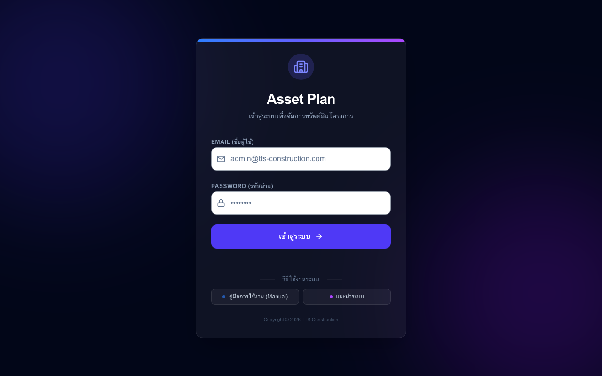

# Visual User Guide — คู่มือการใช้งานระบบ Asset Plan แบบภาพประกอบ

คู่มือฉบับนี้รวบรวมฟังก์ชันการทำงานทั้งหมดของระบบสำหรับทุกบทบาทผู้ใช้งาน (Roles) พร้อมภาพประกอบเพื่อช่วยให้เอเจนต์และผู้ใช้งานสามารถดำเนินขั้นตอนการทำงานได้อย่างถูกต้อง

---

## สารบัญภาพประกอบและฟังก์ชันแยกตามบทบาท

1. [การเข้าสู่ระบบ (Authentication)](#1-การเข้าสู่ระบบ-authentication)
2. [สำหรับผู้ดูแลระบบ (Admin Roles)](#2-สำหรับผู้ดูแลระบบ-admin-roles)
3. [สำหรับทีมคลังกลาง (Store Center)](#3-สำหรับทีมคลังกลาง-store-center)
4. [สำหรับไซต์งาน (Store Site)](#4-สำหรับไซต์งาน-store-site)
5. [สำหรับผู้จัดการโครงการ (Project Manager)](#5-สำหรับผู้จัดการโครงการ-project-manager)

---

## 1. การเข้าสู่ระบบ (Authentication)

### 1.1 หน้าเข้าสู่ระบบ (Login Page)
เมื่อเปิดหน้าเว็บมาจะพบกับหน้า Login สำหรับกรอก Email และ Password เพื่อเข้าสู่ระบบ
- **Email:** `p.pongsada@gmail.com`
- **Password:** `9991IssB343`

### 1.2 การล็อกอินสำเร็จ (Dashboard Home)
หลังจากเข้าสู่ระบบสำเร็จ จะถูกนำทางไปยังหน้าหลัก ซึ่งจะแสดงรายการเมนูด้านบนตามสิทธิ์ที่มี

---

## 2. สำหรับผู้ดูแลระบบ (Admin Roles)

ผู้ดูแลระบบมีหน้าที่จัดการข้อมูลพื้นฐานของผู้ใช้งาน สิทธิ์การเข้าถึง และข้อมูลโครงการ

### 2.1 หน้าจัดการผู้ใช้ (User Management)
เมนูสำหรับการเพิ่ม ลบ หรือแก้ไขบัญชีผู้ใช้ในระบบทั้งหมด รวมถึงการเปลี่ยนรหัสผ่านและการกำหนด Global Role (ADMIN / STORE_CENTER / USER)
- เข้าใช้งานได้ที่: `/admin/users`

### 2.2 หน้าจัดการโครงการ (Project Management)
เมนูสำหรับการเพิ่มโครงการใหม่ และเปลี่ยนสถานะโครงการเป็นใช้งานอยู่หรือย้ายเข้าคลังประวัติ (Archive)
- เข้าใช้งานได้ที่: `/admin/projects`

### 2.3 การกำหนดสิทธิ์โครงการ (Project Roles Assignment)
เมนูสำหรับการกำหนดบทบาทเฉพาะเจาะจงในแต่ละโครงการให้กับสมาชิก เช่น กำหนดให้เป็นผู้บันทึกแผน (STORE_SITE) หรือผู้อนุมัติแผน (PROJECT_MANAGER) ในโครงการนั้นๆ
- เข้าใช้งานได้ที่: `/admin/project-roles`

---

## 3. ข้อมูลครุภัณฑ์หลัก (Master Data)

เมนูสำหรับทีมคลังและผู้ดูแลระบบเพื่อจัดการรหัสครุภัณฑ์ ยอดสต็อกเริ่มต้น และฟังก์ชันการอัปโหลดไฟล์ CSV แบบ Bulk
- เข้าใช้งานได้ที่: `/master-data`

---

## 4. สำหรับไซต์งาน (Store Site)

ทีมหน้างานมีหน้าที่กรอกแผนความต้องการครุภัณฑ์ของโครงการตัวเองในแต่ละงวดหรือรอบการวางแผน (Planning Cycle)

### 4.1 แดชบอร์ดไซต์งาน (Site Plan Dashboard)
หน้ารวมรายการใบงาน (Job Card) ของแต่ละรอบแผนงาน แสดงสถานะปัจจุบัน (OPEN / SUBMITTED / APPROVED / CLOSED) พร้อมตัวเลขนับถอยหลังก่อนหมดเขตส่งแผน
- เข้าใช้งานได้ที่: `/site-plan`

### 4.2 ตารางกรอกแผนความต้องการ (Planning Input Table)
หน้าจอดึงข้อมูลความต้องการครุภัณฑ์แบบรายเดือน มีฟังก์ชันการ ENTER เพื่อคัดลอกค่าไปเดือนถัดไปอัตโนมัติ และแสดง Badge คืนของ "คืน X" เมื่อยอดลดลง
- เข้าใช้งานได้ที่: `/site-plan/[job_id]` (กดปุ่ม **"เริ่มวางแผน"**)

*(รูปภาพอยู่ในขั้นตอนการบันทึกระหว่างรันโฟลว์งาน)*

---

## 5. สำหรับผู้จัดการโครงการ (Project Manager)

PM มีหน้าที่ตรวจสอบความต้องการที่ไซต์งานส่งมา ปรับตัวเลขตามความเหมาะสม และตัดสินใจอนุมัติหรือส่งกลับไปแก้ไข

### 5.1 ศูนย์ตรวจสอบและอนุมัติ (PM Approval Hub)
หน้าจอรวบรวมใบงานที่ส่งเข้ามาจากไซต์งานทั้งหมดแยกตามแท็บ "รออนุมัติ" และ "ประวัติ"
- เข้าใช้งานได้ที่: `/site-plan/pm-approval`

### 5.2 ตารางรีวิวและแก้ไขยอดของ PM (PM Review Table)
หน้าตารางเปรียบเทียบยอดความต้องการเดิมของไซต์งาน PM สามารถคลิกแก้ไขตัวเลขในช่องตารางได้โดยตรง บันทึกการแก้ไข และกด "อนุมัติ" (Approved) เพื่อส่งต่อให้คลัง หรือกด "ตีกลับ" (Reject) พร้อมใส่หมายเหตุส่งคืนให้ไซต์แก้ไข

*(รูปภาพอยู่ในขั้นตอนการบันทึกระหว่างรันโฟลว์งาน)*

---

## 6. สำหรับทีมคลังกลาง (Store Center)

ทีมคลังกลางจัดการกระบวนการสร้างงวดแผนงาน จัดสรรใบขอเบิกและรับคืน และแสดงตาราง Matrix รายงานภาพรวม

### 6.1 แดชบอร์ดการจัดการงวดงาน (Store Center Cycle Dashboard)
- เข้าใช้งานได้ที่: `/store-center` (แท็บ 1: จัดการใบงาน)

### 6.2 ตารางจัดสรรความต้องการสุทธิ (Store Center Net Demand)
- เข้าใช้งานได้ที่: `/store-center` (แท็บ 2: ความต้องการสุทธิ)
- จัดสรรโดย 5 วิธี: เบิกจ่าย (Dispatch), หมุนเวียน (Circulate), สลับสเปก (Substitute), จัดซื้อ (Buy), เช่า (Rent)

### 6.3 รายงานตารางภาพรวม (Matrix Report Pivot)
ตาราง Pivot Grid เปรียบเทียบความต้องการของไซต์งานเทียบกับสต็อกคลังแต่ละแห่ง เพื่อการวางแผนจัดซื้อจัดจ้างและการโอนย้ายเครื่องมือที่มีประสิทธิภาพสูงสุด พร้อมปุ่มส่งออก Excel
- เข้าใช้งานได้ที่: `/matrix-report`

