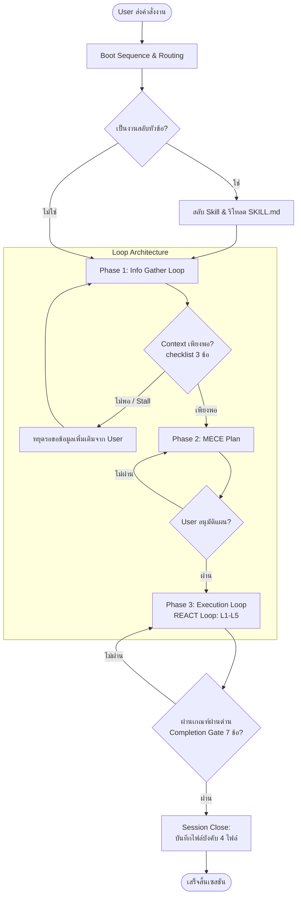
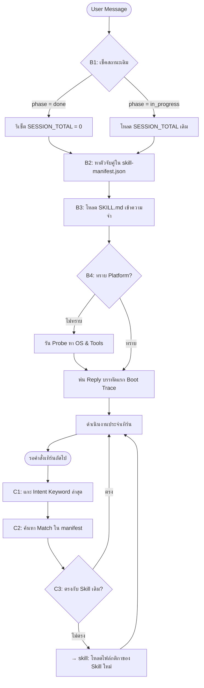
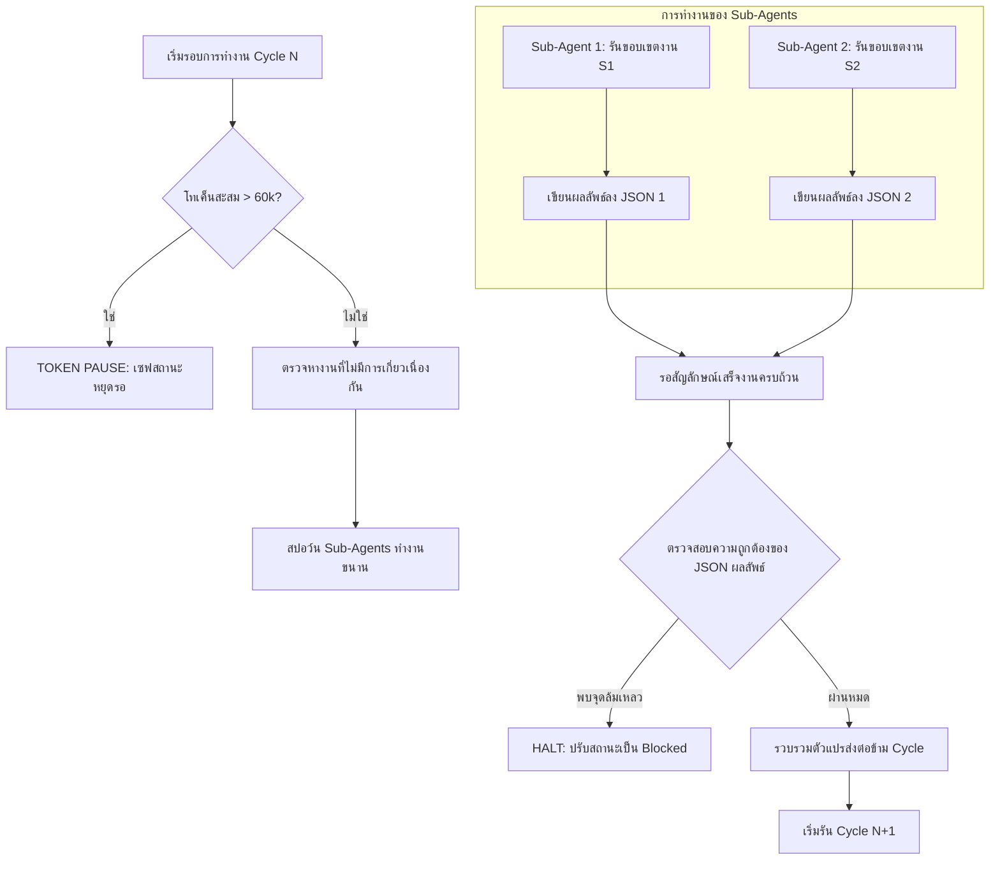
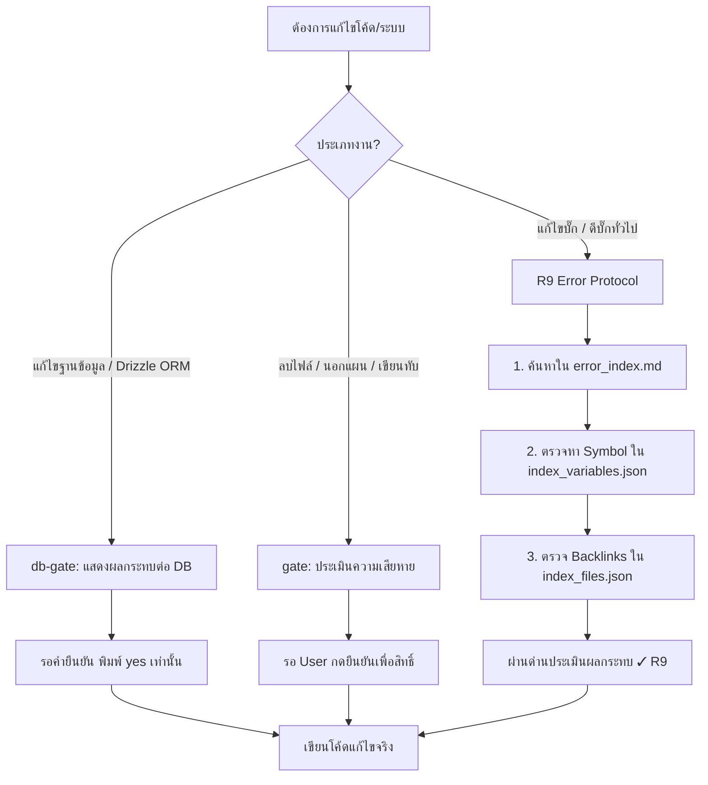
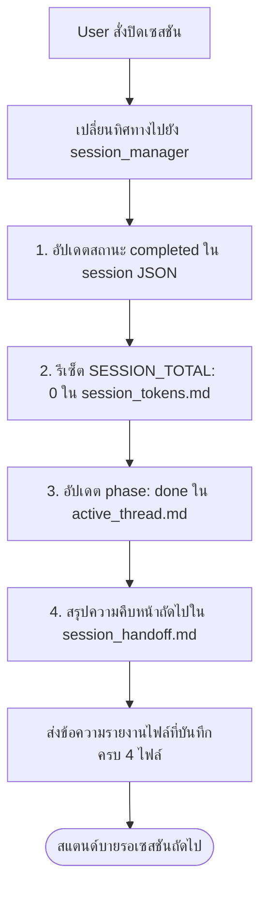

# Agent Harness Workflow — แผนภาพการทำงาน (Flowcharts)

เอกสารฉบับนี้รวบรวมแผนภาพอธิบายขั้นตอนการทำงาน (Flowcharts) ของ Agent Harness ในระบบ **Asset Plan** ตั้งแต่เริ่มต้นจนสิ้นสุดเซสชัน โดยแสดงผลในรูปแบบ **Mermaid Diagram** เพื่อความง่ายต่อการสืบค้นและทำความเข้าใจ

---

## 1. ภาพรวมกระบวนการพัฒนา (End-to-End Lifecycle Overview)

แผนภาพรวมแสดงขั้นตอนทั้งหมดตั้งแต่ได้รับคำสั่งจาก User จนถึงปิดเซสชันสำเร็จ:



---

## 2. ขั้นตอนการบูตและการเลือกสกิล (Boot & Routing Decision)

แสดงลำดับการบูตในเทิร์นแรกและการส่งผ่านงานไปยังสกิลต่างๆ ในแต่ละรอบ (Turn):



---

## 3. สถาปัตยกรรมลูป 3 เฟส (3-Phase Loop Architecture)

ขั้นตอนละเอียดของ **Info Gather**, **MECE Plan** และ **REACT Execution Loop**:

```mermaid
graph TD
    subgraph Phase 1: Info Gather
        G1[G1: ตรวจสอบชิ้นส่วนที่ยังขาด] --> G2[G2: ดึงข้อมูล R5 Index-First]
        G2 --> G3{G3: ประเมิน context_sufficient}
        G3 -->|ไม่ผ่าน & Iteration < 3| G1
        G3 -->|ไม่ผ่าน & Iteration >= 3| Stall[gather-stalled: หยุดถามผู้ใช้]
    end
    
    G3 -->|ผ่าน| Plan[Phase 2: MECE Plan]
    
    subgraph Phase 2: MECE Plan
        Plan --> M1[M1-M2: สร้างแผนงานย่อย 1:1 กับ Skill]
        M1 --> M25[M2.5: กำหนดชุดคำสั่งรันเทสจริง Verify-N]
        M25 --> M3[M3: ส่งแผนให้ User อนุมัติ]
        M3 --> M4[M4-M5: เขียน mece_plan.md & อัปเดต Roadmap]
    end
    
    M4 --> Exec[Phase 3: Execution Loop]
    
    subgraph Phase 3: Execution Loop (L1-L5)
        Exec --> L1[L1: SELECT เครื่องมือที่เหมาะสม]
        L1 --> L2[L2: EXECUTE เขียน/แก้โค้ด / รันคำสั่ง]
        L2 --> L3[L3: OBSERVE ตรวจสอบเออร์เรอร์เบื้องต้น]
        L3 --> L4[L4: VERIFY เขียนไฟล์ Grep / รัน Verify-N]
        L4 --> L5{L5: DECIDE ผ่านครบถ้วน?}
        L5 -->|ไม่ผ่าน| Retry{ลองใหม่ครบ 2 ครั้ง?}
        Retry -->|ไม่ครบ| L1
        Retry -->|ครบ| Blocked[Blocked Halt: หยุดรอตรวจ]
        L5 -->|ผ่าน| NextSec{มี Section เหลือ?}
        NextSec -->|มี| Exec
        NextSec -->|ไม่มี| Done[พร้อมเข้าสู่ Completion Gate]
    end
```

---

## 4. การทำงานขนานและ Sub-Agent (Cycle Orchestration)

จำลองกระบวนการรันงานย่อยไปพร้อมกันด้วย Sub-Agent แบบขนาน:



---

## 5. การจัดการสิทธิ์และการแก้ไขฐานข้อมูล (Gates & Error Protocols)

กระบวนการความปลอดภัยและการรับมือกับข้อผิดพลาด:



---

## 6. สรุปกระบวนการปิดเซสชัน (Session Close Flow)

ขั้นตอนหลังจากตรวจรับงานสำเร็จ และปิดแอปพลิเคชันอย่างเป็นระเบียบ:


